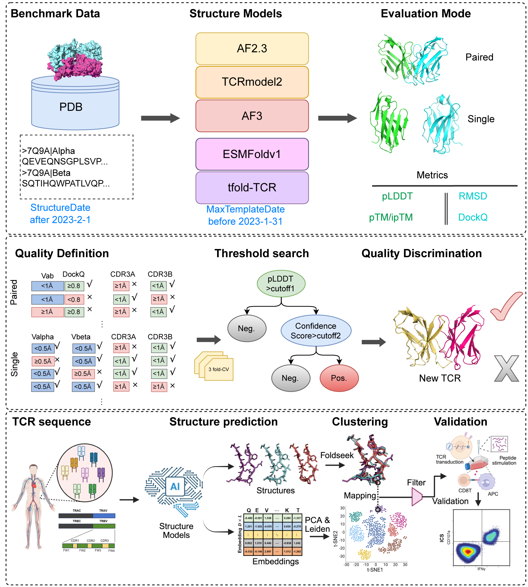

# TCRStrucBench
This project aims to evaluate structure prediction accuracy of five PLMs (AF2.3, TCRmodel2, AF3, ESMfoldv1 and tfold-TCR), develop prediction quality classifiers, and validate downstream applications of structural and embedding clustering for antigen-specific TCRs.

