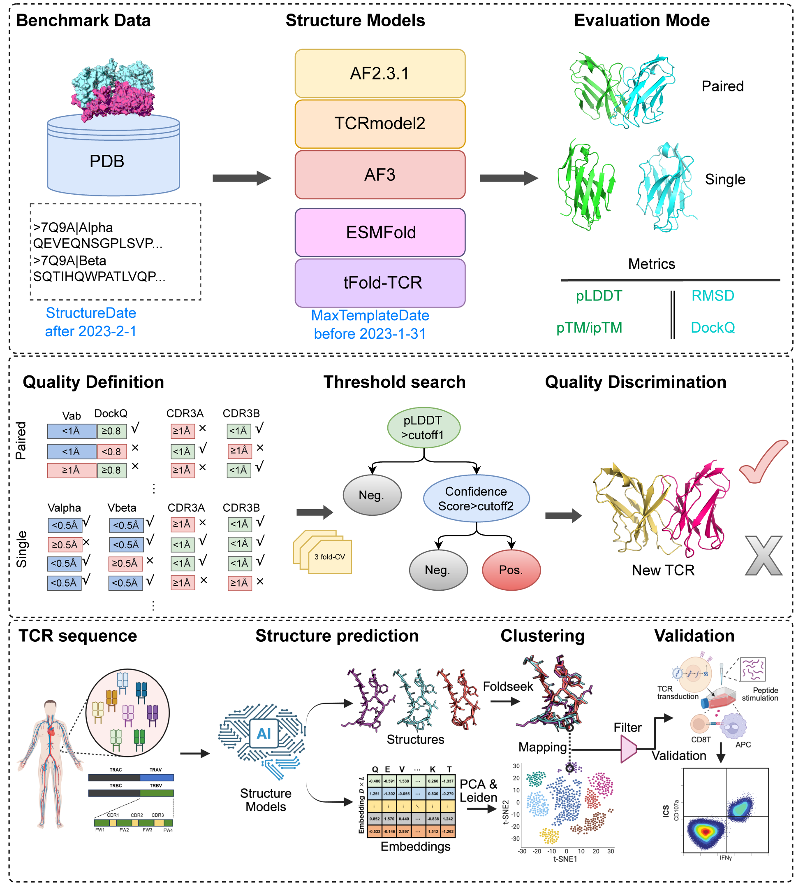

# TCRStrucBench

## 📖 Introduction
This project aims to evaluate structure prediction accuracy of five computational models for TCR (AF2.3.1, TCRmodel2, AF3, ESMfold and tFold-TCR), develop prediction quality classifiers, and validate downstream applications of structural and embedding clustering for antigen-specific TCRs.


## ⚙️ Conda Environment Setup
To ensure strict reproducibility and avoid package conflicts, we highly recommend using conda to set up the virtual environment. Using Conda (Recommended).
```bash
# Clone the repository
git clone https://github.com/ImmunoInformatics-dev/TCRStrucBench
cd TCRStrucBench


# Create and activate the conda environment
conda env create -f environment.yml
conda activate TCRStrucBench
```
## ⚙️ Model Installation
The computational models could be downloaded and installed in the following link:
1. AF2.3.1 (non_docker): https://github.com/kalininalab/alphafold_non_docker
2. TCRmodel2: https://github.com/piercelab/tcrmodel2
3. AF3: https://github.com/google-deepmind/alphafold3
4. ESMFold: https://github.com/facebookresearch/esm
5. tFold-TCR: https://github.com/TencentAI4S/tfold

## 💾 Data Preparation
Due to file size constraints, large intermediate files are hosted externally.  
However, the essential data files required to run the evaluation pipeline are included in this repository (in ./data and ./result directory).

## 🚀 Step-by-Step Reproduction
Step 1: Annotate the TCR sequences, clean and fix pdb files. (in ./data_process directory)  
Step 2: Evaluate structural prediction performance, calculates the comparative metrics (pLDDT, pTM, RMSD) across different models. (in ./pred_eval directory)  
Step 3: Correlation analysis could be found in ./corr directory.  
Step 4: Scripts of quality evaluation model are located in ./classifiers directory.  
Step 5: Cluster analysis could be found in ./cluster directory.  

## 📧 Contact
For any questions regarding the code or data, please open an issue or contact Fu-rong Qi at qifurong2012@gmail.com.